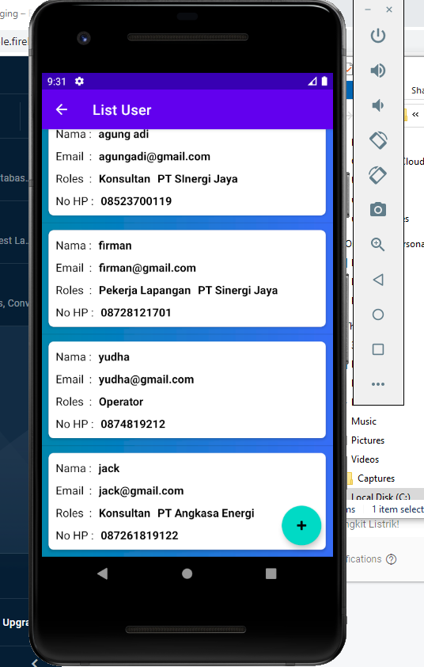

# UAS - DOKUMENTASI POWERCOIL

## DESKRIPSI

Sistem Monitoring Pembangkit Listrik Energi Baru Terbarukan (Power Coil) adalah  aplikasi untuk memantau pembangkit listrik tenaga angin dan pembangkit listrik tenaga bayu. Data di ambil dari JSON yang di di aplikasikan dengan rest api pada oracle cloud kemudian di fetch untuk ditampilkan pada aplikasi. Power Coil memungkinkan melihat notifikasi pembangkit listrik yang tidak normal dan alert warning pembangkit listrik yang sedang mengalami kendala. 

## Fitur :
1. Multiple Login Admin, Operator, Konsultan & Pekerja Lapangan.
2. Beranda 
- Tahap 1 Pengkajian :Pada tahap pengkajian konsultan melakukan input data pada aplikasi PowerCoil lalu pekerja proyek akan men-survey tempat yang akan dijadikan pembangkit listrik.
- Tahap 2 Surat Perintah Kerja (SPK) :  Pada tahap SPK, setelah proses survey selesai dan proses pengkajian selesai maka Konsultan Proyek akan membuat SPK untuk pekerja lapangan. Konsultan Proyek dapat mengupload SPK pada aplikasi ini, dan pekerja proyek dapat mendownload SPK.
- Tahap 3 Pemasangan : Pada tahap pemasangan pekerja proyek datang ke lokasi yang telah disetujui dengan membawa SPK. Pada proses pemasangan pekerja proyek diharuskan mengisi data data yang ada pada tahap pemasangan di aplikasi ini.
- Tahap 4 Operasi : Pada tahap Operasi berisi status tiap titik pembangkit, terdapat alert pada setiap warna, merah = darurat, kuning = peringatan, hijau = aman.
3. Push Notifikasi dengan firebase yang dijadwal kan pagi dan sore sebagai pengingat admin/operator & Notifikasi terdapat daftar pembangkit listrik yang sedang mengalami masalah.
4. CRUD user berisi informasi list pengguna aplikasi
5. Faq & Panduan Aplikasi
6. Logout

## Hasil 

1. Halaman Splash Screen

2. Halaman Login(Use SQLite)

### Admin

1. Halaman Home Admin

2. Halaman Side Navigation

3. Halaman Notification

4. Halaman Operasi Google Maps

5. Halaman Warning Alert Monitoring

6. Halaman List Pembangkit Listrik

7. Halaman Detail Pembangkit Listrik

8. Halaman Edit Pembangkit Listrik dan Hapus Pembangkit Listrik

9. Halaman Tambah Pembangkit Listrik.

10. Listview User 

11. Tambah User

12. Edit User

13. Delete User

14. List Pengkajian 

14. Tambah Pengkajian 

15. Detail Pengkajian

16. Download SPK

16. Edit Pengkajian

16. Delete Pengkajian

17. Halaman Panduan

18.  Halaman Faq

### Konsultan

1.Login sebagai konsultan

2.Home konsultan

3. Fitur Pengkajian dapat di akses hak akses penuh oleh Konsultan

4. Fitur User pada konsultan hanya bisa CRUD sebagai Pekerja Lapangan.

### Pekerja Lapangan

1.Login sebagai Pekerja Lapangan

2. Home Pekerja Lapangan

3. Pekerja Lapangan dapat hak akses penuh untuk CRUD pembangkit listrik

4. Pekerja Lapangan hanya dapat read pengkajian.

### Operator

1. Login Sebagai operator

2. Home Operator

3. Operator Lapangan dapat hak akses penuh untuk CRUD pembangkit listrik

4. Operator dapat monitoring pembangkit listrik

5. Operator dapat notification

6. Operator dapat memantau pembangkit listrik melalui MAPS

